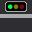
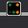
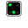

# Model Railway Switchboard – Component Specification

## Overview

A Java Swing-based switchboard component for controlling and visualising a model railway layout.
The component manages turnouts (points), signals, curves, and straight track via a unified
element model and responds to user interaction.

See  [USAGE.md](USAGE.md) |  [USAGE-de.md](USAGE-de.md) for a step-by-step guide on running the application, building a layout,
creating routes, and simulating occupancy.

See  [BUILD.md](BUILD.md) |  [BUILD-de.md](BUILD-de.md) for building from source and installer creation.

The switchboard is rendered as a 60x30 tile grid (each tile 32x32 px). Every tile displays an
SVG icon loaded via [jsvg](https://github.com/weisJ/jsvg) (`com.github.weisj:jsvg:2.1.0`).


### Installer 

[](https://www.fichtelbahn.de/files/wizard-fw/switchboard-demo/getLatestLink.php?type=msi&version=1.0)

---

## Architecture

### Design Patterns

| Pattern       | Purpose                                                                     |
|---------------|-----------------------------------------------------------------------------|
| **MVC**       | Separates layout state (Model), rendering (View), and user actions (Controller) |
| **Observer**  | Propagates model state changes to the UI via `PropertyChangeSupport`              |
| **Command**   | Encapsulates actions (cycle element) with undo/redo support                |
| **State**     | Models per-element aspects as integer ordinals (0..N-1)                    |
| **Strategy**  | Pluggable occupancy serialization (`OccupancySerializer`) and dialog creation (`AssignOccupancyDialogFactory`) |
| **Composite** | Composes all tile types into a unified grid panel                          |

---

## Requirements

- **Java 21+** required. The project uses Java 21 features including
  `SequencedCollection`, `indexOfFirst`/`indexOfLast`, `Math.clamp`, and
  `String.repeat`/`String.stripIndent`.

## Dependencies

| Library | Version | Purpose |
|---------|---------|---------|
| `com.github.weisj:jsvg` | 2.1.0 | SVG rendering |
| `tools.jackson.core:jackson-databind` | 3.1.4 | JSON serialization (via jackson-bom) |
| `com.formdev:flatlaf` | 3.7.2 | Look and Feel (Light/Dark) |
| `org.slf4j:slf4j-api` | 2.0.18 | Logging facade |
| `ch.qos.logback:logback-classic` | 1.5.34 | Logging implementation |
| `tokyo.northside:assertj-swing-junit-jupiter` | 4.0.0-beta-3 | GUI testing (test scope) |
| `org.bytedeco:javacv-platform` | 1.5.13 | Screen recording for GUI tests (test scope) |
| `org.junit.jupiter:junit-jupiter-engine` | 6.0.3 | Test runner (test scope) |

---

## Components

### **Unified Element System**

All railway elements use int ordinals (0..N-1) for their aspect/state. There are no
type-specific enums — just element types distinguished by prefix.

#### `ElementType` (enum)
| Enum | Prefix | Visible | Aspects | Clickable |
|------|--------|---------|---------|-----------|
| `TURNOUT_LEFT` | `TL` | yes | 2 (straight, diverted left) | yes |
| `TURNOUT_RIGHT` | `TR` | yes | 2 (straight, diverted right) | yes |
| `TURNOUT_3WAY` | `T3` | yes | 3 (straight, left, right) | yes |
| `SIGNAL_3` | `S3` | yes | 3 (red, green, yellow) | yes |
| `SIGNAL_V` | `SV` | yes | 4 (orange, green, orange+green, orange+both greens) | yes |
| `STRAIGHT` | `P` | yes | 1 | no |
| `CURVE_LEFT` | `CL` | yes | 1 | no |
| `CURVE_RIGHT` | `CR` | yes | 1 | no |
| `DIAGONAL` | `DG` | yes | 1 | no |
| `BUMPER` | `BS` | yes | 1 | no |

Route finding uses `isValidThroughPath(port1, port2, rotation)` which validates that
a train can traverse the tile from an entry port to an exit port. Turnouts only allow
common-heel→frog-end paths (e.g., LEFT↔RIGHT and LEFT↔BOTTOM for TURNOUT_RIGHT),
preventing frog-end→frog-end traversal. DIAGONAL elements allow all combinations
connecting bottom-left corner ports with top-right corner ports.
`hasValidDiagonal(port1, port2, rotation)` checks whether a tile's SVG track path has
an endpoint at the given corner, used for diagonal neighbor connections.

Element IDs follow the pattern `{prefix}-{number}`, e.g. `"TL-001"`, `"S2-001"`, `"SV-001"`, `"P-001"`.
IDs are generated uniquely per prefix by scanning existing model elements for the highest suffix.

---

### `Element`
- Value class for a railway element.
- Fields: `id` (String), `nodeId` (long), `accessoryId` (long), `currentAspect` (int),
  `occupancy` (Occupancy, nullable).
- Constructed with `new Element(id, nodeId, accessoryId)` — aspect starts at 0.
- Properties exposed via getters; `currentAspect` and `occupancy` have setters.
- Extends `com.jgoodies.binding.beans.Model` — `setOccupancy()` fires `"occupancy"` property change.

### `RailwayModel`
- Single unified model holding all elements and occupancies.
- Uses `PropertyChangeSupport` (idiomatic Java Observer).
- **State**: `Map<String, Element> elements` — elementId → Element object.
  `Map<String, Occupancy> occupancies` — occupancy id → Occupancy object.
- Aspect counts live on the tile (`ElementTile.getAspectCount()`) rather than in the model.
- Fires `PropertyChangeEvent` on every state mutation.
- `addElement()` bridges the Element's property changes to the model's `PropertyChangeSupport`.
- `addOccupancy()` bridges the Occupancy's property changes similarly.
- Methods:
  - `addElement(Element element)`
  - `setElementAspect(String id, int aspect)`
  - `getElementAspect(String id)` / `getElement(String id)`
  - `getElements()` — unmodifiable snapshot `Map<String, Element>`
  - `addOccupancy(Occupancy occupancy)` / `removeOccupancy(String id)`
  - `getOccupancy(String id)` / `getOccupancies()` — unmodifiable `Map<String, Occupancy>`
  - `clear()` / `removeElement(String id)` / `containsElement(String id)`
  - `addPropertyChangeListener` / `removePropertyChangeListener`

### `Route`
- Immutable value class for a found route path.
- Fields: `id` (`"{sourceElementId}-{targetElementId}"`), `sourceElementId`, `targetElementId`, `path` (ordered `List<int[]>` of `[col, row]`).
- `containsTile(col, row)` — checks if a grid tile is part of the route.

### `RouteModel`
- Manages multiple simultaneous active routes.
- Uses `PropertyChangeSupport` for change notifications.
- **Alternative routes**: Each route ID can have a list of alternative paths found via BFS
  (short mode: block one primary edge at a time; exhaustive mode: also block edges of found alternatives).
  A `selectedAlternativeIndex` map tracks which alternative is currently previewed (-1 = none).
- Methods:
  - `addRoute(Route)` — adds a route.
  - `addAlternativeRoute(Route)` — adds an alternative for a route ID; sets index to 0 on first addition.
  - `removeRoute(String id)` — removes a route by ID (including its alternatives).
  - `getRoute(String id)` / `getRoutes()` — access routes.
  - `getAlternativeRoutes(String id)` — returns all alternatives for a route ID.
  - `getAlternativeRoute(String id)` — returns the alternative at the selected index, or null.
  - `setSelectedAlternativeIndex(String id, int index)` — sets preview index (-1 = no preview).
  - `clearAlternatives(String id)` — removes all alternatives and the index entry.
  - `swapWithAlternative(String id)` — promotes previewed alternative to primary, clears alternatives.
  - `isTileReserved(col, row, excludeRouteId)` — checks if a tile is used by any route (except the excluded one).
  - `routeIdForTile(col, row)` — returns the route ID using a tile, or null.
  - `clear()` / `size()` / `isEmpty()`
  - `addPropertyChangeListener` / `removePropertyChangeListener`

### `Block`
- A connected path of tiles forming a railway block section.
- Fields: `id` (String, unique), `name` (String, user-editable), `path` (ordered `List<int[]>` of `[col, row]`).
- Default name equals the id (`blk001`, `blk002`, ... zero-padded).
- A block never contains turnout tiles (TURNOUT_LEFT/RIGHT/3WAY are excluded during path finding).
- `containsTile(col, row)` — checks if a grid tile is part of the block.

### `BlockModel`
- Manages all blocks on the switchboard.
- Enforces **one block per tile**: `addBlock(Block)` returns `false` if any tile already belongs
  to a different block.
- Uses `PropertyChangeSupport` for change notifications.
- Methods:
  - `addBlock(Block)` — adds a block; returns false on tile conflict.
  - `removeBlock(String id)` — removes a block and releases its tiles.
  - `renameBlock(String id, String newName)` — updates a block's name.
  - `getBlock(String id)` / `getBlocks()` — access blocks.
  - `blockIdForTile(col, row)` / `getBlockForTile(col, row)` — tile → block lookup.
  - `clear()` / `size()` / `isEmpty()`
  - `addPropertyChangeListener` / `removePropertyChangeListener`

### `Occupancy`
- Concrete class in `org.bidib.switchboard.component.model` representing track occupancy.
- Fields: `id` (String, auto-generated as `"occ-N"`), `state` (OccupancyState: FREE/OCCUPIED).
- Extends `com.jgoodies.binding.beans.Model` — fires `"state"` property changes via `firePropertyChange` in `setState()`.
- Subclasses can add hardware-specific fields:
  - `DemoOccupancy` in `org.bidib.switchboard.demoapp.config` adds `nodeId`/`portId`.
  - `TestOccupancy` in `org.bidib.switchboard.component.config` adds `extReference`.
- Created via `OccupancyFactory.create(OccupancyState state)`.
- Stored in `RailwayModel.occupancies` keyed by `occ.getId()`.
- Elements reference an `Occupancy` via `getOccupancy()` / `setOccupancy()` (nullable, clears on null).
- Persisted in `LayoutData.ModelStateData.occupancies` and restored on load.

---
### `Tile`
- Represents a single grid cell at `(col, row)`.
- Carries an optional `elementId` and a single `svgResource` path.
- Has a `rotation` field (0/90/180/270) applied as a transform during rendering.
- Has a `direction` field (`TileDirection`: FORWARD/BACKWARD/BOTH, default BOTH).
  - Only enforced on STRAIGHT and DIAGONAL tiles during route search.
  - Rendered as a light-gray filled triangle pointing in the allowed direction.
  - Persisted in JSON as `"direction": "FORWARD"` (omitted if BOTH).
- Has a `signalSide` field (`SignalSide`: LEFT/RIGHT/DEFAULT, default DEFAULT).
  - Resolved via `globalSignalSide` on the panel when DEFAULT.
  - Stored per‑tile in JSON as `"signalSide": "RIGHT"` (omitted if DEFAULT).
- `Tile.key(col, row)` — static utility returning the tile map key.
- Used for decorative tiles with no elementId.
- Subclass: `ElementTile`.

### `ElementTile extends Tile`
- Unified tile for any railway element (turnout, signal, curve, straight).
- Contains a `List<String> svgPaths` indexed by aspect ordinal.
- Contains an `ElementType` for serialization/creation.
- `getSvgForAspect(int ordinal)` — returns the matching SVG path (falls back to index 0).
- `getAspectCount()` — returns `svgPaths.size()`.
- `applySignalSide(SignalSide resolvedSide)` — swaps SVG paths between `_left` and `_right` variants in place.
- `getMainSignalId()` / `setMainSignalId(String)` — optional reference to the main signal (SIGNAL_3) a distant signal (SIGNAL_V) previews. Null when unlinked; persisted in the layout file.

---

### `SwitchboardPanel` (View)
- Extends `JPanel`, implements `PropertyChangeListener`.
- Default grid: 60 columns x 30 rows, 32 px per tile (1920×960 px total).
- Registers as observer on the `RailwayModel`.
- Delegates route finding to `RouterService`.
- **Modes**:
  - **Normal**: left-click cycles aspects on clickable tiles (aspectCount > 1). Clicking a main signal (SIGNAL_3) also switches every linked distant signal to the matching preview aspect.
  - **Edit**: left-click selects tiles (cyan border), Ctrl+R rotates selected tile 90°, right-click context menu to place/clear tiles. No aspect cycling. Selection clears when edit mode is turned off.
  - **Route Finding**:
  - Ctrl+click source tile, then Ctrl+click target tile.
  - Source marker (green filled oval) appears immediately on first Ctrl+click.
  - BFS finds path using physical port connectivity (orthogonal + diagonal).
  - BFS skips tiles already reserved by existing routes (conflict detection).
  - Diagonal port checks use OR (not AND) on corner ports, enabling symmetric traversal
    through curves and diagonals in both directions.
   - **Through-path validation**: BFS tracks entry port per tile via `entryPorts` map
     (entry1 for horizontal, entry2 for vertical). Before adding a neighbor,
     `canTraverse()` checks `isValidThroughPath(entry, exit, rotation)` on the current
     tile when either entry port is set. Turnouts block frog-end→frog-end (backwards)
     traversal and invalid diagonal paths through 3-way turnouts.
  - Each connection validates BOTH sender and receiver ports (bidirectional).
  - Diagonal connections require `hasValidDiagonal()` on the sender corner.
  - Found routes are stored in a `RouteModel` supporting multiple simultaneous routes.
    Each route has an ID `{sourceElementId}-{targetElementId}`.
     - Routes render as blue polylines (`(80,80,160)`, stroke-width 4) through tile centers,
    with a green filled oval at the source and a blue filled oval at the target.
   - Turnouts on found routes are auto-set via `aspectForRoute(entryPort, exitPort, rotation)`.
   - **Alternative routes**: When a route is created, BFS finds alternative paths by blocking each edge of the primary path one at a time and re-running. By default this finds short alternatives. When "Exhaustive Route Search" is enabled (File > Settings), alternatives are also found by blocking edges of previously found alternatives (k-shortest-paths iteration), up to `MAX_ALTERNATIVES` (10). All alternatives are stored in `RouteModel` as a list keyed by route ID.
   - When alternatives exist, a white **"+"** badge appears next to both the source and target markers. The badge is positioned below the marker for horizontal route segments and to the right for vertical segments.
   - Right-clicking a route tile shows "Use primary route", "Alternative 1/2/..." (preview), and "Use selected alternative" in the context menu. Each menu item has a colored circle icon matching the alternative's rendering color.
   - Each alternative is drawn with its own color from a 16-color palette (orange, red, purple, teal, pink, amber, maroon, steel blue, lime, coral, indigo, turquoise, gold, rose, violet, sand) as a dotted 4px stroke on top of the main route. The main route remains fully visible during preview.
   - By default, only the selected preview alternative is shown. Other (non-selected) alternatives can be enabled via `setShowOtherAlternatives(true)` which draws them in their palette colors as well.
   - "Use primary route" discards all alternatives and restores normal blue rendering.


   - "Use selected alternative" promotes the previewed alternative to primary route and discards all alternatives.
   - Dotted lines are only visible during preview (index >= 0); they disappear after committing to primary or an alternative.
   - Context menu shows "Clear route ({id})" on tiles belonging to a route,
        "Simulate occupancy ({id})" on the green source circle (disabled while
        that route's simulation is running), "Stop simulation ({id})" while running,
        and "Clear simulated occupancy ({id})" when tiles on the route have OCCUPIED state.
        Multiple routes can run simulations concurrently.
- **Occupancy rendering**: In `paintComponent`, `drawOccupancy()` is called last, after routes. For each tile with an OCCUPIED occupancy, it draws port-based line segments using the element's current aspect: `getActivePorts(el.getCurrentAspect(), tile.getRotation())`. Lines are drawn from tile center to each active port. Straight, diagonal, and crossing elements draw to edge midpoints via `drawPortLine()`. Turnouts draw the main port to its edge midpoint and the diverted port to a corner. Curves (CURVE_LEFT, CURVE_RIGHT) draw port[0] to its edge midpoint and port[1] to a corner: `dx` comes from the port's own x-side if horizontal (or the opposite of port[0]'s x-side if vertical), `dy` comes from the port's own y-side if vertical (or the opposite of port[0]'s y-side if horizontal). Color: `COLOR_OCCUPIED` = `(255, 80, 80)` with stroke-width 4.
- **Signal stops**: During occupancy simulation, a train arriving at a main signal (SIGNAL_3) with aspect 0 (red) stops and waits. Signals have an implicit facing direction based on rotation (rot 0 → faces LEFT). Only trains entering from the signal's facing port are blocked; trains approaching from behind ignore the signal. `isSignalBlocking(Tile, int entryPort)` implements this check. When `autoChangeSignal` is enabled, a blocked signal auto-switches to aspect 1 after 2 seconds. Toggling this option immediately affects all running simulations.
- **Distant signals (SIGNAL_V)**: Distant signals never stop the train. Each distant signal on a route mirrors the aspect of the next main signal (SIGNAL_3) ahead in the path, previewing the upcoming aspect: orange "Halt erwarten", green "Frei erwarten", orange+green "Langsamfahrt erwarten". The preview is mapped from the next signal's aspect (SIGNAL_3: red→orange, yellow→orange+green, green→green). Mirroring is applied on simulation start and refreshed every simulation step. The fourth aspect (aspect 3: bottom-right orange + both green lights) is only reachable by manually cycling the signal.
- **Direction markers**: STRAIGHT and DIAGONAL tiles can have a direction constraint (`TileDirection`: FORWARD/BACKWARD/BOTH). Route finding (`RouterService.isAllowedDirection`) refuses traversal against the tile's direction. Rendered as a light-gray filled triangle via `drawDirectionMarkers()`.
- **Signal side**: SIGNAL_3 and SIGNAL_V tiles support a per‑tile signal side override (LEFT/RIGHT/DEFAULT). The context menu shows a **Signal Side** submenu in edit mode (labels internationalized via `ResourceBundle`). Changing the side immediately updates the tile's SVG paths via `ElementTile.applySignalSide()`. The **Tile Info** dialog displays the resolved signal side for signal tiles.
- **Distant signal linking**: A distant signal (SIGNAL_V) can be linked to the main signal (SIGNAL_3) it previews via `ElementTile.mainSignalId`. In edit mode the context menu shows an **Assign Main Signal** submenu listing every placed main signal plus **None**; when no link is set, the nearest main signal straight ahead in the travel direction is preselected (marked "(auto)") via `suggestMainSignalForDistant()`. Once linked, clicking the main signal in normal mode switches every linked distant signal to the matching preview aspect (`SetElementAspectCommand`, pushed onto the undo stack so undo restores distant signals first). Clearing a main signal with linked distant signals asks whether to **Remove linked** (also removed, undoable), **Keep** (the link is removed), or **Cancel**. The link is persisted in the layout file and shown in the **Tile Info** dialog (Main signal / Distant signals).
- **Blocks**: A connected, turnout-free path of tiles defining a track section. In edit mode the context menu shows a **Block** submenu to set a block start tile (orange square marker), then a block end tile. The connected path (via `RouterService.bfsBlockPath`) is found automatically, excluding turnouts and tiles of other blocks. Each block gets a unique id and a default name `blkNNN`; names are editable via **Rename Block...** dialog. Blocks render as a 2px yellow line (`(255,220,80)`) offset 4px below the track center, with a short vertical tick at the outer edge of the start and end tiles. Removal asks for confirmation. Blocks are persisted in the layout file.
   - **Curve-aware block lines**: On curve tiles the yellow block line bends around the corner, staying on the block side of the track. `curveCorner` locates the curve's corner pixel from its rotation (`center + rotateDelta(±half, ±half, rotSteps)`). The tile's center offset follows the straight-side neighbour (`straightSideDirection`, so a vertically-entered curve keeps the incoming straight run aligned), and `exitsThroughCorner` decides whether the elbow point comes before or after the center. The line follows the offset diagonal via `blockGuidePoint`/`curveGuidePoint` instead of crossing the track. Block lines that **end** on a curve terminate a few pixels *before* the corner pixel (`curveEndpoint`, pulled back `CORNER_PULL=5` along the offset track diagonal) so they never merge with or collide into the main track line. Blocks that start or end on a **diagonal** tile keep running parallel to the track diagonal (`diagonalEndpoint`) and stop at the tile edge the track exits through (e.g. upper-right) instead of cutting straight across to the side.
- - `getPhysicalPorts(rotation)` returns all physical port indices for a tile.
   `getActivePorts(aspect, rotation)` returns only the ports active for a given aspect (1 port for straight/curve/diagonal, 2 for turnouts, 4 for crossings).
- **Rendering** (`paintComponent`):
  - Uses `Graphics2D` with antialiasing and bilinear interpolation.
  - Draws tiles first, then grid lines, then selection border (edit mode only).
  - Each tile renders its SVG icon via `SVGDocument.render(Component, Graphics2D, ViewBox)`.
  - Rotation is applied via `Graphics2D.rotate()` around the tile center.
  - For `ElementTile` tiles, resolves the SVG path from the model's current aspect.
- **Interaction**:
  - Left-click: selects position + cycles aspect (normal) or selects only (edit).
     - Right-click: context menu with Info (element data dialog), ElementTypes + Signals submenu,
       Assign Occupancy / Remove Occupancy (edit mode only), Assign Main Signal (distant signals,
       edit mode only), Clear route on route tiles,
       Simulate occupancy on route start tile (disabled while running, creates sliding
       occupancy animation), Clear simulated occupancy on any route tile with OCCUPIED
       state (disabled while running). Clearing a main signal with linked distant signals
       shows a removal confirmation (Remove linked / Keep / Cancel).
  - Ctrl+R: rotates selected tile 90° (edit mode only).
  - Edit-mode tooltip shows element ID on hover.
- **Thread safety**:
  - All repaints triggered via `SwingUtilities.invokeLater`.
- Constructor: `SwitchboardPanel(RailwayModel, AssignOccupancyDialogFactory)` and `SwitchboardPanel(RailwayModel, AssignOccupancyDialogFactory, int cols, int rows, int tileSize)`.
- Public API:
  - `setTile(Tile tile)` / `getTile(int col, int row)` / `removeTile(int col, int row)`
  - `clearTiles()` / `getModel()` / `undoLast()`
  - `isEditMode()` / `setEditMode(boolean)`
   - `setExhaustiveRouting(boolean)` — enables exhaustive alternative route search.
   - `setShowOtherAlternatives(boolean)` — shows non-selected alternatives as dotted cyan lines during preview when `true` (default `false`).
   - `setTileContextHandler(TileContextHandler)` — callback for context menu actions.
   - `testSetRouteAspects(List<int[]>)` — applies aspect-for-port/route logic to a given path (test helper).
- **Undo stack**: `Deque<Command> undoStack` — pushed by route finding, tile creation/clearing, aspect cycling, and linked distant signal mirroring. Accessible via `undoLast()`. Menu item Edit > Undo (Ctrl+Z).

---

### `Command` (Interface)
- `void execute()` / `void undo()`

### `CycleElementCommand`
- Implements `Command`.
- Computes `(oldAspect + 1) % aspectCount` in constructor, stores both old and new values.
- `execute()` calls `model.setElementAspect(id, newAspect)`.
- `undo()` calls `model.setElementAspect(id, oldAspect)`.
- Logs execute/undo via SLF4J.

### `SetElementAspectCommand`
- Implements `Command`.
- Captures the element's current aspect in the constructor.
- `execute()` calls `model.setElementAspect(id, newAspect)`.
- `undo()` calls `model.setElementAspect(id, oldAspect)`.
- Used by `SwitchboardPanel` to mirror a linked distant signal's aspect when a main signal is clicked; pushed after the main signal's command so undo restores the distant signal first.

### `CreateRouteCommand`
- Implements `Command`.
- Captures new route, previous route (if replacing), alternatives, and pre-route aspects.
- `execute()` removes previous route (if any), then adds new route + alternatives + sets old aspects.
- `undo()` removes new route, restores previous route, restores pre-route aspects.
- Handles `newRoute == null` for the case where a route is cleared (BFS failure on re-route).

### `TileCommand`
- Implements `Command`.
- Captures old tile and new tile state at a grid cell.
- `execute()` removes old tile/element, creates new tile/element.
- `undo()` removes new tile/element, restores old tile/element.

---

### `SvgIconLoader`
- Utility that loads and caches `SVGDocument` instances from classpath resources using jsvg.
- Thread-safe `ConcurrentHashMap` cache.

---

### `RouterService`
- Stateless service class encapsulating the route-finding logic.
- Constructed with `Map<String, Tile> tiles`, `int cols`, `int rows`, `RouteModel routeModel`.
- `bfsRoute(startCol, startRow, endCol, endRow)` — BFS-based shortest path using physical port connectivity.
  Returns `List<int[]>` path or `null`. Tries without tile-revisit override first; falls back with override
  (max 8 revisits per tile) only if the first attempt returns null.
- `bfsBlockPath(startCol, startRow, endCol, endRow, excludedTiles)` — BFS-based connected path for blocks.
  Never passes through turnout tiles and avoids tiles belonging to other blocks (via `excludedTiles`).
  Returns `List<int[]>` or `null`.
- `bfsAlternativeRoutes(startCol, startRow, endCol, endRow, primaryPath, exhaustive)` — finds alternative
  routes by blocking edges of the primary path (and of found alternatives when `exhaustive=true`).
  Never uses tile-revisit override. Returns `List<List<int[]>>`.
- `setRouteAspects(path, model)` — sets turnouts on a found route to the correct aspect. For diagonal entries
  (both `prevDc` and `prevDr` non-zero), tries both the vertical and horizontal entry port and prefers the
  higher (diverted) aspect.
- `diagonalAwarePort(from, to, isEntry)` — computes which port a diagonal movement enters/exits through.
- Extracted from `SwitchboardPanel` to enable direct testing and reuse.

### `LayoutPersistence`
- Serializes the full switchboard state (tiles + model + occupancies) to JSON using Jackson 3.
- Instance-based class. Constructor takes an `OccupancySerializer` to handle occupancy serialization during deserialization.
- `capture(TileGrid)` / `save(TileGrid, Path)` — write state.
- `load(TileGrid, Path)` / `apply(TileGrid, LayoutData)` — read state.
- Tile type string format: `{prefix}{count}`, e.g. `"TL2"`, `"T32"`, `"S22"`, `"S32"`, `"P1"`, `"CL1"`, `"CR1"`, `"DG1"`.
- Type is matched by iterating `ElementType.values()` and testing `typeStr.startsWith(prefix)`.
- Occupancies are serialised in `ModelStateData.occupancies` and element→occupancy references via `occupancyId` on each `ElementData`.

### `SettingsManager`
- Manages `settings.json` at `~/switchboard-demo-1/settings.json`, separate from the layout file.
- Stores the `lastLayoutFile` path, the `lastLayoutDirectory` (parent of the last layout), the `lookAndFeel` setting, and the `signalSide` default.
- Loaded on startup; auto-saves on every change.
- `setLastLayoutFile()` also persists the layout's parent directory; `getLastLayoutDirectory()` returns it for the file choosers.

### `LayoutData` / `SettingsData`
- POJOs for Jackson serialization.
- `LayoutData` holds grid dimensions, tile list (with type, svgPaths, rotation, direction, signalSide, and optional mainSignalId for linked distant signals), `ModelStateData`, routes, and blocks.
- `ModelStateData` holds a `List<ElementData>` (each containing `id`, `nodeId`, `accessoryId`, `aspect`, `occupancyId`) and a `List<OccupancyData>` (each containing `id`, `nodeId`, `portId`, `state`).
- `BlockData` (list under `blocks`) holds `id`, `name`, and an ordered `tiles` list of `[col, row]` coordinates.
- `SettingsData` holds `lastLayoutFile`, `lastLayoutDirectory`, `lookAndFeel` (LIGHT/DARK enum), and `signalSide` (LEFT/RIGHT).

---

## Application (`SwitchboardApp`)

### Menu

| Menu | Item | Shortcut | Action |
|------|------|----------|--------|
| File | Load... | `Ctrl+L` | JFileChooser to load a `.json` layout, opened in the directory of the active layout (or the last layout directory from settings) |
| File | Save | `Ctrl+S` | Save to current file, or Save As if none |
| File | Save As... | `Ctrl+Shift+S` | JFileChooser to save to a new location, opened in the active layout's directory (or the last layout directory from settings) |
 | File | Settings > Light Look and Feel | — | Switch to FlatLaf light theme |
| File | Settings > Dark Look and Feel | — | Switch to FlatLaf dark theme |
| File | Settings > Signal Side | — | Submenu: Swiss (default LEFT) / German (default RIGHT) |
| File | Settings > Exhaustive Route Search | — | Toggle k-shortest-paths search for more alternative routes |
| File | Exit | — | Exit application |
| Edit | Undo | `Ctrl+Z` | Undo last tile or route operation |
| Edit | Edit Mode | `Ctrl+E` | Toggle normal/edit mode |
| Edit | Load Default Layout | — | Load the built-in default layout |
| Edit | Occupancies... | — | Show dialog with all occupancies sorted by id |
| Edit | Auto-change signal | — | Toggle: auto-switch blocked signals to aspect 1 after 2s during simulation |

### Toolbar
- `wrench.png` / `wrench_selected.png` toggle button with tooltip "Toggle Edit Mode", synced with the Edit menu item.

### Internationalization

All UI strings (menu bar, toolbar, context menu, tile info dialog) are loaded from
`ResourceBundle` files supporting **English** and **German** locales:

| Bundle | File (English) | File (German) | Scope |
|--------|---------------|---------------|-------|
| Component | `i18n/messages.properties` | `i18n/messages_de.properties` | Context menu, info dialog |
| Demo App | `i18n/app-messages.properties` | `i18n/app-messages_de.properties` | Main menu, toolbar, frame title |

The locale is determined by the system locale at startup (`Locale.getDefault()`). Parameterized
strings use `java.text.MessageFormat` (e.g., `"Clear route ({0})"`, `"Position: ({0}, {1})"`).

### On startup
1. Load `settings.json` from project root
2. Apply saved Look and Feel (Light or Dark)
3. Read the `lastLayoutFile` path → load layout from that file (if it exists)
4. Fall back to the hardcoded default layout if no settings or file is found

### Default layout
- `"TL-001"` (2-way left turnout at 2,3)
- `"TR-001"` (2-way right turnout at 3,3)
- `"T3-001"` (3-way turnout at 4,3)
- `"S2-001"` (2-aspect signal at 10,3)
- `"S3-001"` (3-aspect signal at 11,3)
- `"SV-001"` (distant signal / Vorsignal at 12,3)
- `"P-001"`..`"P-005"` (straight track at row 0, cols 0-4)

### Logging

The application logs via SLF4J/Logback to the console and to a log file:

- **Windows**: `%USERPROFILE%\Documents\switchboard-demo\switchboard-demo-app.log`
- **Other OS**: `<java.io.tmpdir>/switchboard-demo-app.log`

The log directory is created automatically if it does not exist. The file
location can be overridden with the system property `-Dswitchboard.logfile=...`.
Logging configuration lives in `switchboard-demo-app/src/main/resources/logback.xml`.

---

## SVG Icons (`switchboard-component/src/main/resources/icons/` — tracks in `tracks/`, signals in `signals/sbb_l/`)

| File | Preview | Description |
|------|---------|-------------|
| `empty.svg` |  | Dark background only |
| `straight.svg` |  | Full light gray horizontal line |
| `turnout_straight_left.svg` |  | Straight active (light gray+orange), diverted left gray |
| `turnout_straight_right.svg` |  | Straight active (light gray+orange), diverted right gray |
| `turnout_diverted_left.svg` |  | Left diverted active (light gray+orange), straight gray |
| `turnout_diverted_right.svg` |  | Right diverted active (light gray+orange), straight gray |
| `turnout_3way_straight.svg` |  | Straight active, both diverted gray |
| `turnout_3way_left.svg` |  | Left active, straight and right gray |
| `turnout_3way_right.svg` |  | Right active, straight and left gray |
| `curve_left.svg` |  | Horizontal to center then diagonal to top-right |
| `curve_right.svg` |  | Horizontal to center then diagonal to bottom-right |
| `diagonal.svg` |  | Diagonal from lower-left to upper-right corner |
| `bumper_stop.svg` |  | Bumper stop (red/white) at a dead end |
| `signal_3_red_left.svg` / `_right` |  | SBB signal shape (Swiss/German) — red active, yellow+green dim |
| `signal_3_yellow_left.svg` / `_right` |  | SBB signal shape (Swiss/German) — yellow active, red+green dim |
| `signal_3_green_left.svg` / `_right` |  | SBB signal shape (Swiss/German) — green active, red+yellow dim |
| `signal_v_orange_left.svg` / `_right` |  | SBB distant (Vorsignal) shape (Swiss/German) — two orange lit, green off ("Halt erwarten") |
| `signal_v_yellow_left.svg` / `_right` |  | SBB distant (Vorsignal) shape (Swiss/German) — two green lit, orange off ("Frei erwarten") |
| `signal_v_green_left.svg` / `_right` |  | SBB distant (Vorsignal) shape (Swiss/German) — right orange + green lit ("Langsamfahrt erwarten") |
| `signal_v_aspect3_left.svg` / `_right` |  | SBB distant (Vorsignal) shape (Swiss/German) — bottom-right orange + both green lights lit (aspect 3) |

All icons are 32×32 viewBox with a dark background (#2d2d32). Track lines use light gray `#aaaaaa` for active paths, `#808080` for inactive paths, and `#ffa500` (orange) for the frog-end on turnouts.

### Additional resources
| Path | Description |
|------|-------------|
| `switchboard-component/src/main/resources/signals/sbb_l/SBB-L-H01.svg` | Source SBB L signal shape (200x400, rotated for icons) |
| `switchboard-component/src/main/resources/signals/sbb_l/SBB-L-V16.svg` | Source SBB L distant signal (Vorsignal) shape (200x400, rotated for icons) |

---

## Tests

102 tests across eleven test classes:

### `SwitchboardAppTest` (7 tests)
| Test | Description |
|------|-------------|
| `frameTitleContainsSwitchboard` | Frame title includes "Model Railway Switchboard" |
| `fileMenuContainsLoadSaveSaveAsSettingsAndExit` | File menu items visible |
| `editMenuContainsEditModeLoadDefaultAndOccupancies` | Edit menu items visible |
| `toolbarContainsEditModeToggle` | Edit Mode toggle button visible |
| `settingsMenuHasLightAndDarkAndExhaustiveItems` | Light/Dark Look and Feel + Exhaustive Route Search items visible |
| `clearSelectionItemVisibleOnlyInEditMode` | Clear selection only appears in edit mode |
| `occupancyPersistenceRoundtrip` | Occupancies and element assignments survive `capture()`/`apply()` round-trip |

### `RouteFindingTest` (31 tests)
| Test | Description |
|------|-------------|
| `routeThroughDivertedTurnouts` | (0,0)→(10,1) via TR-003/TR-002 diverted, verifies aspect set |
| `routeFromRow3Col2ToRow5Col10` | (2,3)→(10,5) found |
| `routeFromRow3Col2ToRow4Col10` | (2,3)→(10,4) found |
| `routeFromRow3Col2ToRow0Col10` | (2,3)→(10,0) blocked by turnout through-path constraints |
| `routeFromRow1Col10ToRow3Col2` | (10,1)→(2,3) reverse-direction found |
| `twoNonOverlappingRoutesCoexist` | Two disjoint routes exist simultaneously in `RouteModel` |
| `routeConflictBlocksOverlappingRoute` | BFS skips tiles reserved by existing routes |
| `removeRouteById` | Route removed from model by ID |
| `routeModelClearRemovesAllRoutes` | Clearing `RouteModel` removes all routes |
| `routePersistenceRoundTrip` | Routes survive `capture()`/`apply()` round-trip |
| `routeModelIsTileReserved` | `isTileReserved()` correctness with/without exclusion |
| `routeIdFormat` | Route ID format `"{source}-{target}"` |
| `routeContainsTile` | Route includes source/target, excludes out-of-bounds |
| `alternativeRouteFoundForP015ToP065` | BFS finds 2 alternative routes via T3-001/T3-002 diagonals |
| `alternativeRouteFoundForP015ToTL004` | Exhaustive BFS finds 4 alternatives via T3 diagonals + row-11 corridor |
| `undoRouteCreation` | Route removed from model after undo |
| `undoRouteReplaceRestoresPreviousRoute` | Original route restored after undo of replacement |
| `undoRouteClearRestoresPreviousRoute` | Original route restored after undo of BFS-failed re-route |
| `undoTileCreationOnEmptyCell` | Empty cell and element removed from model after undo |
| `undoTileReplaceRestoresOriginalTile` | Original tile and element restored after undo |
| `occupiedTileOnRouteIsDetected` | Tile on a route detected as occupied when its occupancy is set to OCCUPIED |
| `routeFromP114ToP137MustNotUseInvalidTurnoutPath` | Route from P-114 to P-137 must not go via (25,13)→(24,14) — verifies canTraverse is called for vertical-only entries |
| `routeFromP112ToCL013WithAndWithoutPreExistingRoutes` | Route from P-112 to CL-013 found both with and without pre-existing CR-010-P-130 — verifies BFS override fallback |

### `RouterServiceTest` (11 tests)
| Test | Description |
|------|-------------|
| `bfsRouteWithStartOutsideGrid` | Start column or row out of bounds returns null |
| `bfsRouteWithEndOutsideGrid` | End column or row out of bounds returns null |
| `bfsRouteWithBothOutsideGrid` | Both start and end out of bounds returns null |
| `bfsRouteWithNullStartTile` | Tile not present at start coordinates returns null |
| `bfsRouteWithNullEndTile` | Tile not present at end coordinates returns null |
| `bfsRouteFindsValidPath` | BFS finds path from (2,3) to (10,5) on default layout |
| `bfsAlternativeRoutesReturnsAlternatives` | BFS finds 2 alternative paths from (2,3) to (24,6) |
| `bfsAlternativeRoutesExhaustive` | Exhaustive BFS finds 4 alternative paths from (2,3) to (7,11) |
| `diagonalAwarePort` | Correct port mapping for 8-direction neighbor offsets |
| `bfsRouteReturnsNullWhenBlocked` | BFS returns null when no path exists between valid tiles |
| `diagonalConnectsThroughDiagonalTiles` | Diagonal tiles connect via corner ports in both directions |

### `BlockTest` (16 tests)
| Test | Description |
|------|-------------|
| `blockCreatedFromStartAndEnd` | Block created from start (0,0) to end (6,0) with id `blk001`, 7 tiles |
| `blockIdIncrementsZeroPadded` | Second block gets id `blk002` |
| `blockCannotPassThroughTurnout` | No block created when the path would include a turnout |
| `blockPathBfsExcludesTurnoutTiles` | `bfsBlockPath` returns turnout-free connected path |
| `blockPathAvoidsExcludedTiles` | `bfsBlockPath` respects tiles excluded by other blocks |
| `tileBelongsToOnlyOneBlock` | Overlapping block rejected; disjoint block allowed |
| `renameBlockUpdatesName` | Block name changed via `BlockModel.renameBlock` |
| `removeBlockReleasesTiles` | Removing a block frees its tiles |
| `blockPersistenceRoundTrip` | Blocks survive `capture()`/`apply()` round-trip with id/name/tiles |
| `blockPathWithoutStartReturnsNull` | Creating a block without a start returns null |
| `curveEndpointStopsLeftOfCornerForCurveRightRotation0` | `curveEndpoint(16,1,[15,1])` for CR-003 rot 0 terminates 4-9px left of the bottom-right corner (544,64) and below the track diagonal |
| `blockEndingOnCurveUsesCurveEndpoint` | `blockEndpoint(path,1)` for a block ending on CR-003 (rot 0) yields an endpoint left of x=540, pulled back before the corner |
| `curveGuidePointStaysBesideTrackForCurveRightRotation180` | `curveGuidePoint` for CR-002 (rot 180) keeps the elbow guide point 4px below/left of the track diagonal beside the corner |
| `blockThroughCurveKeepsStraightRunAlignedWithOrthogonalNeighbor` | On `switchboard-block2.json`, the curve tile (14,4) entered vertically from (14,5) is offset via its straight side (0,-1) so the run stays on x=460 instead of drifting onto the diagonal exit |
| `blockEndingOnDiagonalContinuesToUpperRightEdge` | On `switchboard-block3.json`, `blockEndpoint` for blk003 (ending on the diagonal DG-006 at (24,18)) follows the diagonal to the upper-right edge (800,580) instead of cutting horizontally at the centre row |
| `diagonalEndpointExitsThroughEdgeInExitDirection` | `diagonalEndpoint` runs the block line 4px below the tile centre parallel to the track diagonal and exits through the edge in each of the four diagonal directions |

### `BlockUiTest` (3 tests)
| Test | Description |
|------|-------------|
| `createBlockFrom16x4To7x4InEditMode` | UI test: enables edit mode, creates block `blk001` from (16,4) to (7,4) on `switchboard-block1.json`, verifies 10 tiles span cols 7–16 of row 4. Screen recording support via `ScreenRecorder`.
| `createBlockThroughCurveRightRotation180InEditMode` | UI test: creates block from (7,5) to (5,4) passing through CR-002 at (6,5) rotation 180, verifies the curve is the middle of the 3-tile path |
| `createBlockEndingOnCurveRightRotation0InEditMode` | UI test: creates block from (15,1) to (16,1) ending on CR-003 at (16,1) rotation 0, verifies the curve is the last of the 2-tile path |

### `DebugTest` (1 test)
| Test | Description |
|------|-------------|
| `debugP015toTL004` | Convenience test with `System.out` output for manual debugging of route finding |

### `RouteFindingUiTest` (7 tests)
| Test | Description |
|------|-------------|
| `undoRouteCreationViaUI` | Route removed after undo via Edit > Undo menu |
| `undoRouteReplaceViaUI` | Original route restored after undo of UI replacement |
| `undoRouteClearViaUI` | Original route restored after undo of BFS-failed UI re-route |
| `undoTileCreationOnEmptyCellViaUI` | Empty cell restored after undo via Edit > Undo menu |
| `undoTileReplaceViaUI` | Original tile restored after undo of UI tile replacement |
| `occupiedRouteTilesDetectedViaUI` | Occupied route tiles show occupancy color via `drawOccupancy` |

### `OccupancyUiTest` (12 tests)
| Test | Description |
|------|-------------|
| `occupancyAdvancesAlongRoute` | Timer-driven occupancy animation along a route path, verifying sliding-window pattern |
| `routeFromTL003ToTR002` | Route found from TL-003 to TR-002 with correct source/target element IDs, TL-003 aspect 1 (diverted) |
| `routeFromTL003ToTR002Straight` | Primary route TL-003→P-001 along row 0, TL-003 aspect 0 (through), alternatives cleared |
| `alternativeRouteTL003ToP001` | Alternative route TL-003→P-001 via DG-003/CL-005/row-1 corridor, verified 23-tile path, TL-003 aspect 1 (diverted), TR-003 aspect 1 (diverted) |
| `routeP112ToCL013WithAndWithoutPreExistingRoutes` | Route P-112→CL-013 found with and without pre-existing CR-010-P-130 via UI test hooks |
| `distantSignalDoesNotStopTrainAndMirrorsNextSignal` | Distant signal (SIGNAL_V) never stops the train and mirrors the aspect of the next main signal (uses `switchboard3a.json`) |

Timer-driven tests use a `Semaphore` to synchronise the test thread with the Swing `Timer` tick,
replacing brittle `Thread.sleep()` delays that could miss steps due to timer coalescing.
`maven-surefire-plugin` is configured with `--add-opens java.base/java.util=ALL-UNNAMED`
to prevent `InaccessibleObjectException` from AssertJ Swing's `ProtectingTimerTask`.

Screen recording is supported for occupancy and block UI tests via `ScreenRecorder` (JavaCV + FFmpeg).
Pass `-Dscreen.recording=true` when running `mvn test` to capture MP4 videos of the test
execution to `target/surefire-reports/`.

### `OccupancyElementUiTest` (2 tests, 1 disabled)
| Test | Description |
|------|-------------|
| `occupancyCyclesThroughAllElements` | Timer-driven occupancy cycle across all 11 ElementTypes × all aspects × 4 rotations plus right-side signal variants (120 elements), verifying sliding-window pattern. Tiles built programmatically in `@BeforeEach` (one row per aspect, four rotations in columns 0/3/6/9, insertion-order iteration). |
| ~~`occupancyAtCurveRotations`~~ | ~~Verifies `drawOccupancy` line endpoints for all CURVE_LEFT and CURVE_RIGHT rotations: first port draws to edge midpoint, second port draws to the corner determined by the exit port and its tangent.~~ |

### `SignalVDemoUiTest` (1 test)
| Test | Description |
|------|-------------|
| `displayDistantSignalForVisualCheck` | Visual check: renders all SIGNAL_V aspect icons (orange, yellow, green, aspect 3) for left/right variants with lamp ID labels, 2×4 grid |

### `SignalLinkTest` (10 tests)
| Test | Description |
|------|-------------|
| `linkSurvivesLoad` | `mainSignalId` restored when loading `switchboard3a.json` |
| `linkSurvivesPersistenceRoundTrip` | Distant→main link survives `capture()`/`apply()` round-trip |
| `switchingMainSignalToZeroSwitchesLinkedDistantSignalToZero` | Clicking main S2-009 to red (0) switches linked SV-001 to 0; to green (1) mirrors to 1 |
| `clickingLinkedDistantSignalDoesNotChangeItsAspect` | Clicking a linked distant signal leaves its aspect untouched; clicking the main signal still mirrors |
| `mirrorUndoRestoresBothSignals` | Undo restores distant signal first, then the main signal cycle |
| `unlinkedDistantSignalIsNotAffectedByOtherMainSignals` | Clicking a main signal without linked distants leaves SV-001 unchanged |
| `suggestMainSignalFindsSignalAhead` | Auto-suggest finds S2-009 straight ahead of SV-001 |
| `removeLinkedChoiceRemovesDistantSignalWithUndo` | "Remove linked" removes distant+main, undo restores both with the link |
| `keepChoiceKeepsDistantSignalUnlinked` | "Keep" removes main only and clears the link on the distant signal |
| `cancelChoiceAbortsRemoval` | "Cancel" leaves main and distant signal untouched |

Uses `switchboard3.json`, `switchboard3a.json`, `switchboard4.json`, `switchboard5.json`, `switchboard6.json`, `switchboard7.json`, `switchboard-block1.json`, `switchboard-block2.json`, and `switchboard-block3.json` test layouts. 101 of 102 tests pass (1 disabled).

---

## AI Agent Guidelines

See `AGENTS.md` in the project root for rules governing AI-generated contributions,
including attribution and co-authorship requirements.

---

## Build & Run

```
mvn compile exec:java -Dexec.mainClass=org.bidib.switchboard.demoapp.SwitchboardApp -pl switchboard-demo-app
mvn test
mvn test -Dscreen.recording=true   # with MP4 screen recording for occupancy UI tests
mvn clean package -DskipTests -pl switchboard-demo-wix-installer -am   # build Windows MSI installer
```

### Modules

| Module | Packaging | Description |
|--------|-----------|-------------|
| `switchboard-component` | jar | Core library: model, view, persistence, simulation |
| `switchboard-demo-app` | jar | Demo application with hardware-specific extensions |
| `switchboard-demo-wix-installer` | msi | Native Windows installer (WiX 6, Launch4j, bundled JRE) |

---

## Related Projects

- [jbidibc](https://github.com/akuhtz/jbidibc) — Java BiDiB library for controlling model railways

---

## Changelog

### v1.0-SNAPSHOT

**2026-08-04 — signal consolidation**

- Removed the two-aspect `SIGNAL_2` element type entirely (enum, palette, rendering, simulation, demo app) and migrated all layouts to `SIGNAL_3`.
- Canonicalized the `SIGNAL_3` aspect order to **[red, green, yellow]** (svgPaths index = aspect). Distant signal mirroring is now an identity mapping since aspect indices align.
- Renumbered signal ids sequentially per layout (`S2-XXX` → `S3-XXX`) and rebuilt route ids from their source/target elements.
- Migrated all bundled test layouts plus the live layouts under `~/.bidib/data/switchboard/`; deleted the orphaned `signal_2_*.svg` icons.

**2026-08-02/03 — signals**

- Added the SBB distant signal (`SIGNAL_V`, Vorsignal) with orange/green/aspect-3 aspects; it never stops the train and mirrors the next main signal ahead.
- Added main-signal linking for distant signals, with undoable "remove linked" / "keep" handling; clicking a linked distant signal leaves its aspect untouched.
- Showed signal driving direction in edit mode and corrected the signal lamp layouts for both signal sides.

**2026-07 — occupancy & routing**

- Added occupancy model, persistence, and per-aspect occupancy rendering on the switchboard.
- Added alternative route finding with preview/selection, exhaustive k-shortest-paths search, and route conflict detection (extracted into `RouterService`).
- Added edit mode with tile placement/rotation, Undo (Ctrl+Z) for tile and route operations, and JGoodies-bound occupancy assignment dialog.

**2026-07-12 — unified element system**

- Unified all railway elements into a single `ElementTile`/`ElementType` model with prefix-based type resolution and per-aspect SVG paths.
- Introduced through-path validation for route-finding BFS and diagonal/curve connectivity fixes.
